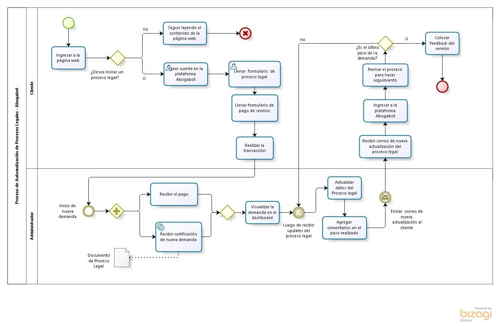
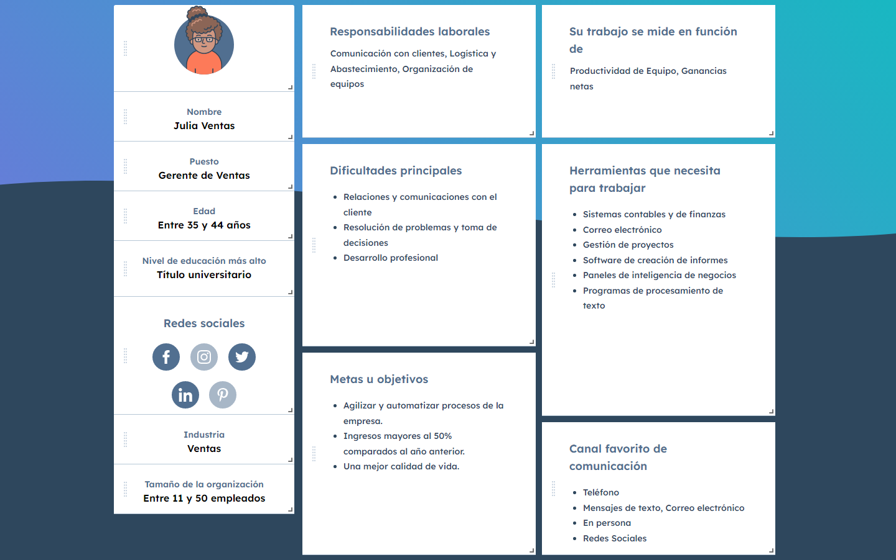
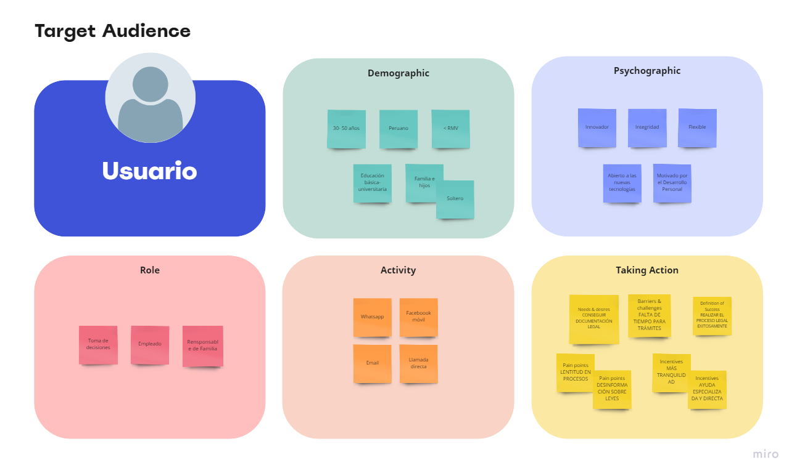
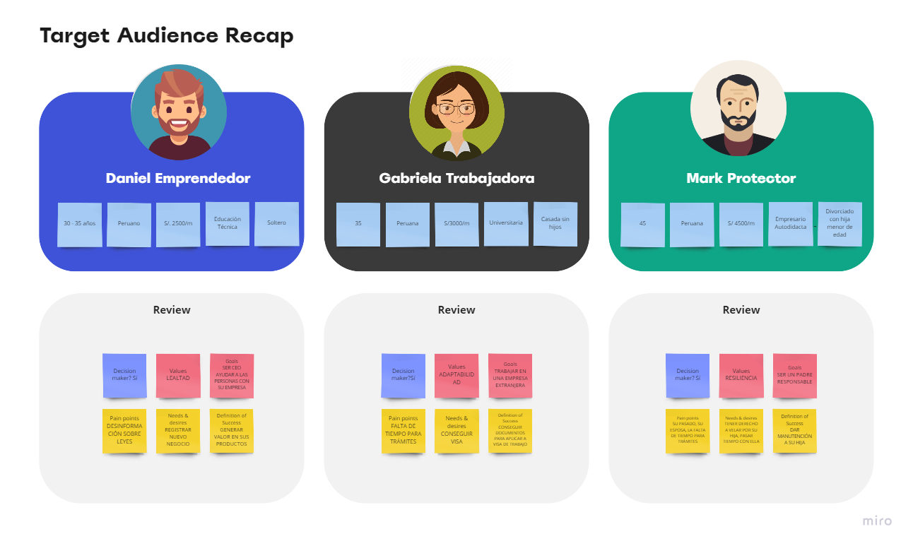

# LaunchX-Abogabot

Primer proyecto de la Mission Front-End para LaunchX LATAM.

**Caso: Abogabot** Descripción:

- Es un despacho de abogados que quiere automatizar las demandas de sus clientes, esto lo harán a traves de una página web llenando un formulario.
- Al momento de llenar el formulario se manda al proceso de pago para finalizar la transacción.
- Para dar seguimiento a su demanda, el cliente crea una cuenta en la plataforma y verá el seguimiento de cada una de las actualizaciones del proceso legal.
- El administrador del sitio recbe la notificación de una nueva demanda y con los datos llenados del formulario se crea automaticamente el documento legal en formato word para empezar el proceso.
- El administrador recibe el pago y debe de ser capaz de verlo en un dashboard para ver la cantidad de ingresos recibidos.
- El administrador actualiza el proceso de la demanda y agrega comentarios en cada paso del proceso.
- Al usuario le llegan correos de notificación para saber el avance de su proceso.
- La página debe de ser responsive para poderla ver desde el celular.
- La preferencia de colores del cliente es azul marino y blanco, pero acepta propuestas.
   

# *Desarrollo*

## **1. Formato de Especificación de Requerimientos de Software**

  **1.1. Descripción General del Requerimiento**
    
  - PROYECTO : "ABOGABOT"
  - Objetivo : 
      - Reducir el tiempo de trámite y visualización del proceso por parte del cliente en un 90% con respecto al primer semestre del 2022.
      - Automatizar las demandas del cliente y mantener un registro virtual de todos los procesos del despacho de abogados para un facil acceso a la documentación.
  - Medios   : Aplicación web responsiva , Dashboard con Registros de Procesos Legales Iniciados/En proceso
  - Usuario  :  
      - El **cliente** registrado en la plataforma  
      - El **administrador** que da el mantenimiento al sistema
  - Sistema  :  
      - Registra los datos del usuario y almacena para para realizar seguimiento.
      - Cobra por el servicio y registra la transacción.
      - La información puede ser visualizada desde cualquier dispositivo / navegador.
      - El sistema procesa y envía información al Administrador.
      - El sistema puede generar un reporte (Documento de Word) cada que exista una nueva demanda, y será visualizada en un dashboard que solo tendrá acceso el Administrador
      - En cada actualización de la demanda, se le notificará al usuario-cliente sobre el avance de su proceso(porcentaje de progreso).
       - Cada usuario puede interactúar a través de la plataforma y enviar/recibir mensajes sobre su proceso.
      - Cada usuario cuenta con un perfil de usuario, y podrá ver el historial de sus procesos legales cuando lo desee.  
  - Responsable Funcional : Maribel Maza Auccatinco

 

  **1.2. Análisis de Requisitos y Requerimientos**
 
     Diagrama BPM
     
     

  <!-- **1.3. Fases de Planeación y Gerencia de Proyecto**
  

  **1.4. Levantamiento del Requerimiento Detallado (Historias de Usuario)**
   

  **1.5. Diseño de la Arquitectura de Solución**
     Prototipos de Interfaces de Usuario (Wireframes)
       
 -->
## **2. Buyer Persona**

Se puede observar también en el siguiente link :https://www.hubspot.es/make-my-persona?persona=-NFydqaTisj24VXlNso1
 

## **3. Público Objetivo**
 Target Audience - Usuario de Abogabot
     
      
 Resumen de Público Objetivo
     
         
<!-- ## **4. Diseño UX - UI (Figma)**
 -->

   

 
 

*'Abogabot'* es un proyecto realizado por Maribel Maza para la formación en Desarrollo Full-Stack de [Launch X Latam](https://github.com/Launch-X-Latam/MisionFrontEnd/tree/main/01%20-%20INTRO/practicas) ,  Noviembre 2022 🤗
  

 
 
  &nbsp;

